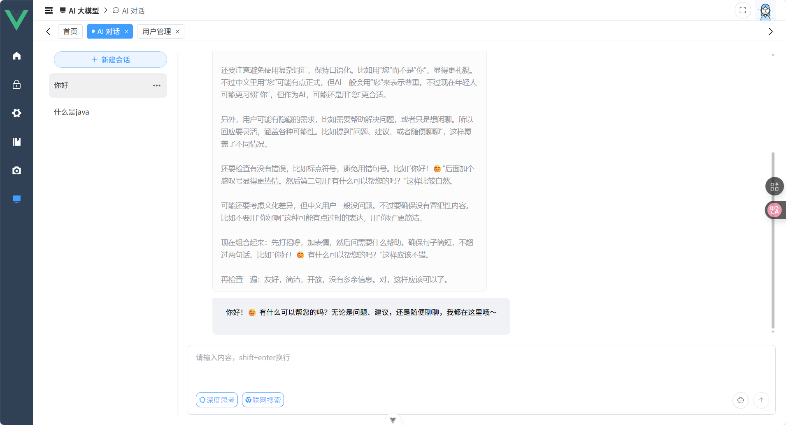

# Springboot-Vue-Admin

## 项目亮点

- 🎉没有过度封装，降低心智负担
- 🎉使用的技术、版本都是比较新的
- 🎉有数据库文件，前后端一篮子解决
- 🎉注重实用性、健壮性，尽量精简
- 🎉maven会将前端打包好的文件放入springboot静态资源目录，同时具备 `部署方便` 和 `单页面应用` 优势（当然也可以分别部署）
- 🎉打包好后，直接java -jar就能启动，无需再配置nginx
- 🎉支持多种数据源，目前支持（h2、mysql、oracle、postgresql）

## 目前已实现

权限管理

- 用户管理
- 角色管理
- 菜单管理（动态权限菜单、菜单缓存）

开发者工具

- 接口文档（swagger）
- 字典管理
- 数据源管理
- 代码生成（mybatis-plus-generator + freemarker）
- 定时任务（quartz）

日志管理

- 登入日志
- 操作日志
- 异常日志

AI 大模型

- AI 对话
- RAG（开发中）

## 功能模块

| 包名                   | 模块                 |
|----------------------|--------------------|
| com.yeeiee.ai        | AI相关模块             |
| com.yeeiee.cache     | 缓存模块               |
| com.yeeiee.codegen   | 代码生成相关模块           |
| com.yeeiee.common    | 一些配置、工具、切面、异常、指标   |
| com.yeeiee.scheduler | 定时任务相关模块           |
| com.yeeiee.system    | 系统模块（RBAC、字典、日志啥的） |

## 版本信息

| 依赖                 | 版本      |
|--------------------|---------|
| JDK                | 17+     |
| Spring-Boot        | 3.5.8   |
| Spring-Ai          | 1.1.2   |
| Mybatis-Plus       | 3.5.14  |
| Node               | 22+     |
| pnpm               | 10+     |
| Vue                | ~3.5.17 |
| Element-Plus       | ~2.11.7 |
| Vue-Element-Plus-X | ~1.3.7  |

## tips

`maven` 打包需要本地拥有 `pnpm` 环境，否则前端无法打包

## 项目截图




## docker 数据测试环境

### 镜像源

```shell
echo docker.1ms.run > ~/mirror
```

### mysql

```shell
docker run -itd \
-p 3306:3306 \
-v ~/docker/mysql/data:/var/lib/mysql \
-v ~/springboot-vue-admin/admin-backend/src/main/resources/sql/mysql/schema-mysql.sql:/docker-entrypoint-initdb.d/1_schema-mysql.sql:ro \
-v ~/springboot-vue-admin/admin-backend/src/main/resources/sql/mysql/quartz-schema-mysql.sql:/docker-entrypoint-initdb.d/2_quartz-schema-mysql.sql:ro \
-v ~/springboot-vue-admin/admin-backend/src/main/resources/sql/mysql/data-mysql.sql:/docker-entrypoint-initdb.d/3_data-mysql.sql:ro \
-e TZ=Asia/Shanghai \
-e MYSQL_ROOT_PASSWORD=123456 \
-e MYSQL_DATABASE=sv_admin \
--name mysql \
$(cat ~/mirror)/mysql
```

### postgresql

```shell
docker run -itd \
-p 5432:5432 \
-v ~/docker/postgresql/data:/var/lib/postgresql \
-v ~/springboot-vue-admin/admin-backend/src/main/resources/sql/postgresql/schema-postgresql.sql:/docker-entrypoint-initdb.d/1_schema-postgresql.sql:ro \
-v ~/springboot-vue-admin/admin-backend/src/main/resources/sql/postgresql/quartz-schema-postgresql.sql:/docker-entrypoint-initdb.d/2_quartz-schema-postgresql.sql:ro \
-v ~/springboot-vue-admin/admin-backend/src/main/resources/sql/postgresql/data-postgresql.sql:/docker-entrypoint-initdb.d/3_data-postgresql.sql:ro \
-e TZ=Asia/Shanghai \
-e POSTGRES_USER=root \
-e POSTGRES_PASSWORD=123456 \
-e POSTGRES_DB=sv_admin \
--name postgresql \
$(cat ~/mirror)/postgres
```

### oracle

系统管理员

- SID: XE
- user: system
- password: 123456

用户账号

- service name: XEPDB1
- username: root
- password: 123456

```shell
docker run -itd \
-p 1521:1521 \
-v ~/springboot-vue-admin/admin-backend/src/main/resources/sql/oracle/schema-oracle.sql:/tmp/schema-oracle.sql:ro \
-v ~/springboot-vue-admin/admin-backend/src/main/resources/sql/oracle/quartz-schema-oracle.sql:/tmp/quartz-schema-oracle.sql:ro \
-v ~/springboot-vue-admin/admin-backend/src/main/resources/sql/oracle/data-oracle.sql:/tmp/data-oracle.sql:ro \
-v ~/springboot-vue-admin/admin-backend/src/main/resources/sql/oracle/1_create_user.sql:/docker-entrypoint-initdb.d/1_create_user.sql:ro \
-v ~/springboot-vue-admin/admin-backend/src/main/resources/sql/oracle/2_create_schema.sh:/docker-entrypoint-initdb.d/2_create_schema.sh:ro \
-e TZ=Asia/Shanghai \
-e ORACLE_PASSWORD=123456 \
--name oracle \
$(cat ~/mirror)/gvenzl/oracle-xe:18-slim-faststart
```