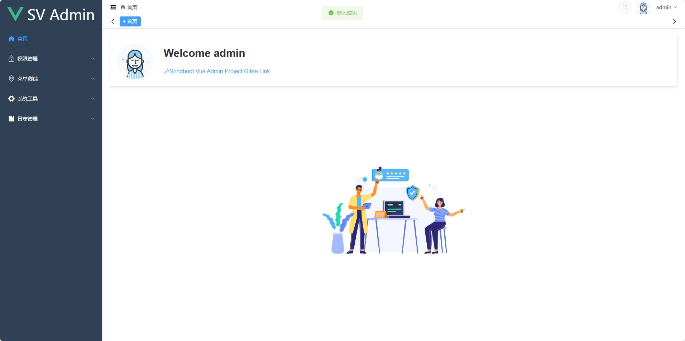
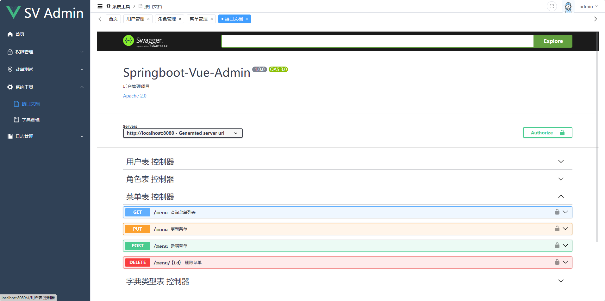
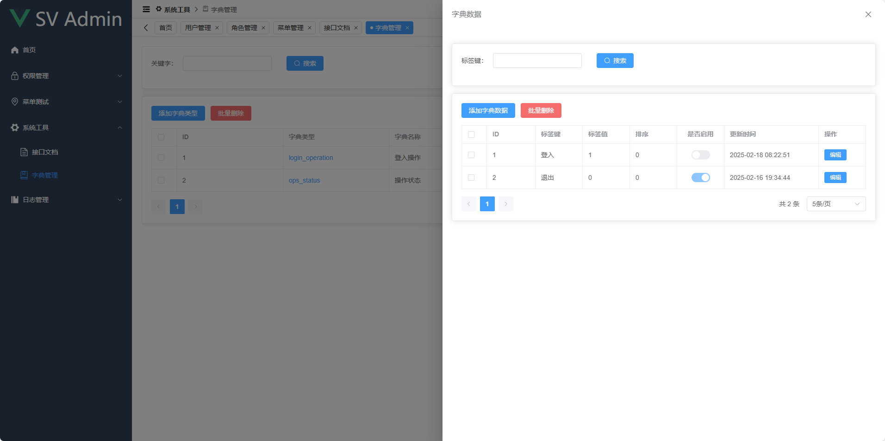
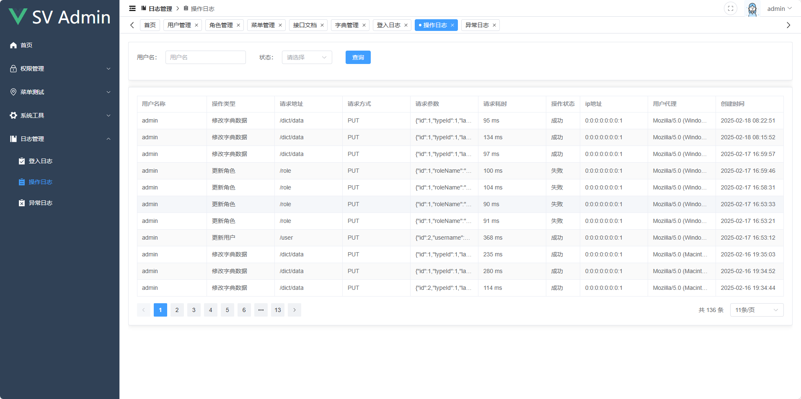
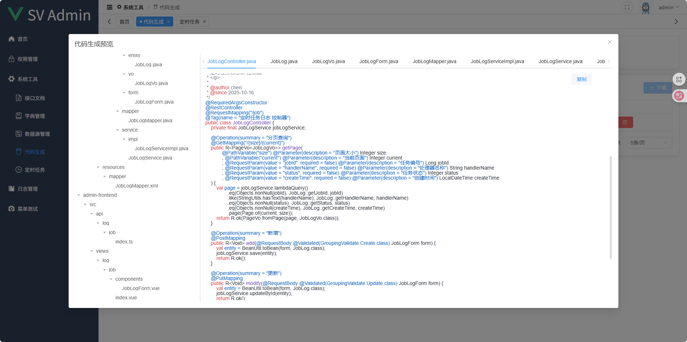
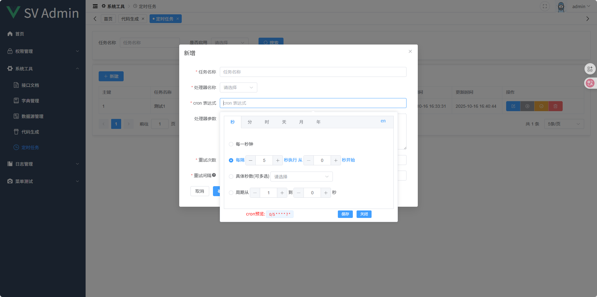

# Springboot-Vue-Admin

## 项目亮点

- 🎉前后端纯手搓，不是二开
- 🎉没有过度封装，降低心智负担
- 🎉使用的技术、版本都是比较新的
- 🎉有数据库文件，前后端一篮子解决
- 🎉注重实用性、健壮性，尽量精简
- 🎉maven会将前端打包好的文件放入springboot，同时具备 `部署方便` 和 `单页面应用` 优势（当然也可以分别部署）
- 🎉打包好后，直接java -jar就能启动，无需再配置nginx
- 🎉支持多种数据源，目前支持（mysql、oracle）

## 目前已实现

权限管理

- 用户管理
- 角色管理
- 菜单管理（动态权限菜单、菜单缓存）

开发者工具

- 接口文档（swagger）
- 字典管理
- 数据源管理
- 代码生成
- 定时任务

日志管理

- 登入日志
- 操作日志
- 异常日志

## 版本信息

| 依赖                  | 版本     |
|---------------------|--------|
| JDK                 | 17+    |
| MySQL               | 8+     |
| Springboot          | 3.2.12 |
| Mybatis-Plus        | 3.5.7  |
| Springboot-Security | 3.2.12 |
| Node.js             | 18+    |
| pnpm                | 9+     |
| Vue                 | 3.4.21 |
| Element-Plus        | 2.8.8  |

## tips

运行打包需要本地拥有 pnpm 环境，否则前端无法打包（个人比较喜欢用 pnpm）

idea打开最好右键排除掉一些不需要索引的文件夹

- admin-backend/src/main/resources/static
- admin-frontend/dist

## 项目截图

